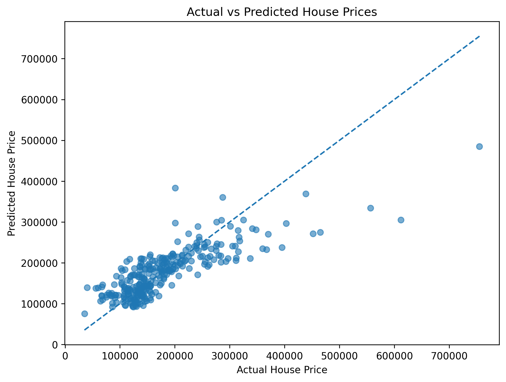

# SCT_ML_1

## House Price Prediction using Linear Regression

### 📌 Project Overview

This project implements a Linear Regression model to predict house prices based on selected property features.

This project was completed as **Task 01** of the **SkillCraft Technology Machine Learning Internship**.

### 🎯 Objective

The objective of this project is to build a machine learning model that predicts house prices using:

- Above-ground living area
- Number of bedrooms
- Number of full bathrooms

### 📊 Dataset

The project uses the **House Prices - Advanced Regression Techniques** dataset from Kaggle.

Dataset: https://www.kaggle.com/competitions/house-prices-advanced-regression-techniques

Target variable:

- `SalePrice` - Sale price of the house

### 🛠️ Technologies Used

- Python
- Pandas
- NumPy
- Matplotlib
- Scikit-learn
- Google Colab
- GitHub

### 🔍 Features Used

| Feature | Description |
|---|---|
| `GrLivArea` | Above-ground living area in square feet |
| `BedroomAbvGr` | Number of bedrooms above ground |
| `FullBath` | Number of full bathrooms |

### 🤖 Machine Learning Model

**Linear Regression**

The dataset was divided into:

- **80% Training data**
- **20% Testing data**

### 📈 Model Evaluation

| Metric | Value |
|---|---:|
| MAE | 35788.06 |
| MSE | 2806426667.25 |
| RMSE | 52975.72 |
| R² Score | 0.6341 |

### 📌 Linear Regression Coefficients

GrLivArea: **104.03**

BedroomAbvGr: **-26655.17**

FullBath: **30014.32**

Intercept: **52261.75**

### 📉 Visualization

An Actual vs Predicted House Prices graph was created to compare the model's predictions with the actual house prices.

### 📝 Interpretation

The R² score of **0.6341** indicates that the model explains approximately **63.41% of the variation in house prices** in the test dataset.

### ✅ Conclusion

A Linear Regression model was successfully implemented to predict house prices using living area, bedrooms, and bathrooms.

### 📂 Project Files

- `SCT_ML_1_House_Price_Prediction.ipynb`
- `actual_vs_predicted_house_prices.png`
- `README.md`

### 👩‍💻 Author

**Nakka Nikitha**
